# The plugin

TvDomSamsung: plugin for remote control of Samsung Tvs.

# Description

The TvDomSamsung plugin is used to control a Samsung TV ( *smart, connected* ) accepting control from commands issued on the local network.

> The plugin is associated with a specific widget (Samsung TV) which is included in the plugin. This widget is installed on the dashboard and serves as a launcher for the remote control module.


## The plugin

The plugin needs to be configured. To do this activate the menu **Plugins -> Gestion des plugins**, then click on the plugin icon TvDomSamsung.

The plugin configuration screen looks like this:


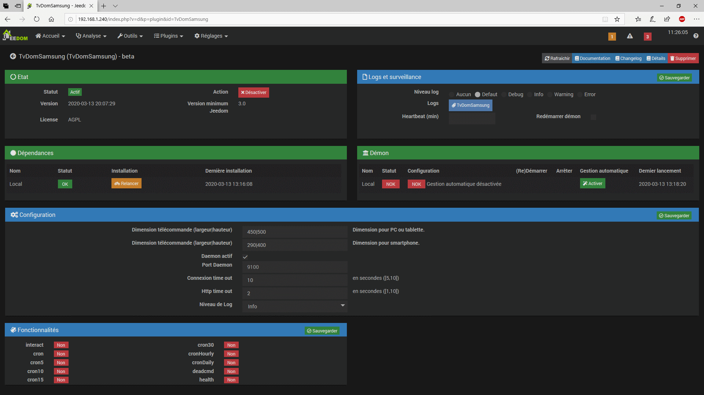

The configuration panel notably includes:

	- dependency management,
	- daemon management specific to Samsung J models,
	- specific parameters to the configuration of the remote       control,
	- the essential parameters of the daemon.

I will not present here the details of the first two panels: dependency and daemon.


The parameters of the daemon are as follows:

- Pause time: time required between sending a sequence of commands to the television. (Used by the sendKey command in a scenario for example).
- Active daemon, check only for Samsung J models. The daemon will only be launched if this choice is activated. It is therefore unnecessary for other TV models.
- Daemon port: daemon communication port. Select an available port on the machine where the daemon will be installed.
- Http time out: time out for http links. Can be adapted according to the latency of the TV.
- Time out connection. (Same).
- Log level. In normal operation, to minimize the volume of logs, set the level to INFO.

Once the entry has been made, save the parameters.

Here is the presentation of the configuration of the plugin for Smart TV models other than the J model.

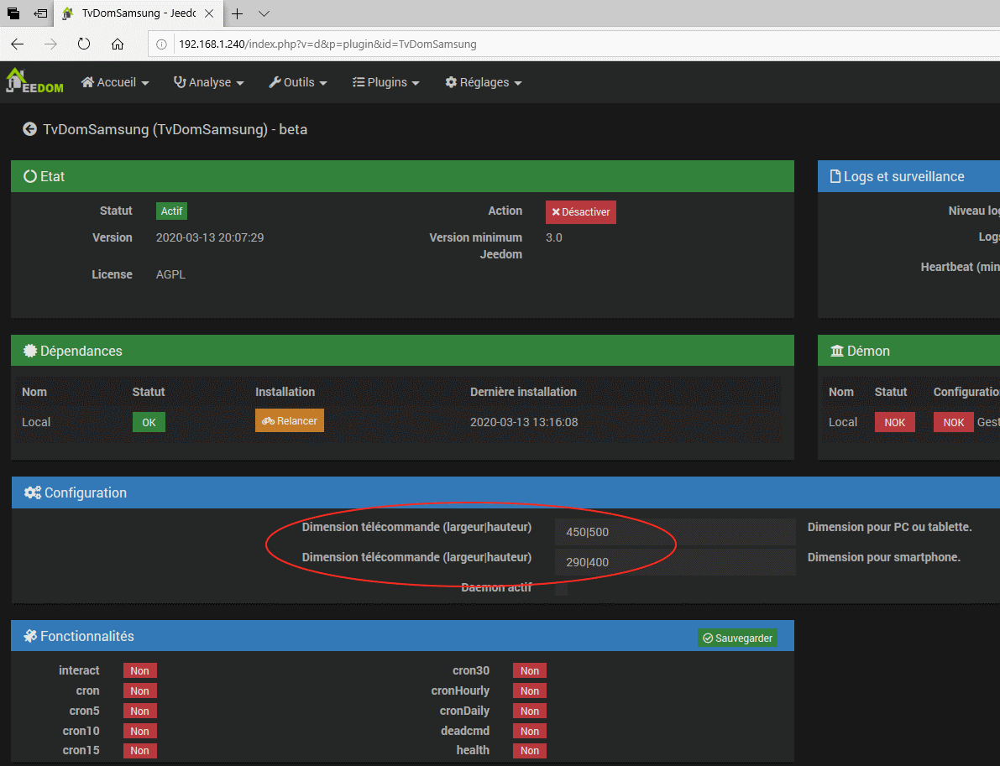


- The daemon parameters are as follows:

  - Pause time: time required between sending a sequence of commands to the television. (Used by the sendKey command in a scenario for example).

  - Daemon active, to be checked only for Samsung J models. The daemon will only be launched if this choice is activated. It is therefore unnecessary for other TV models.
  - Daemon port: communication port of the daemon. Select an available port on the machine where the daemon will be installed.
  - Http time out: time out for http connections. Can be adapted according to the latency of the TV.
  - Connection time out. (Same).
  - Log level. In normal operation, in order to minimize the volume of logs, set the level to INFO.

  Once the entry is made, save the parameters.

  Here is the presentation of the plugin configuration for Smart TV models other than the J model.

  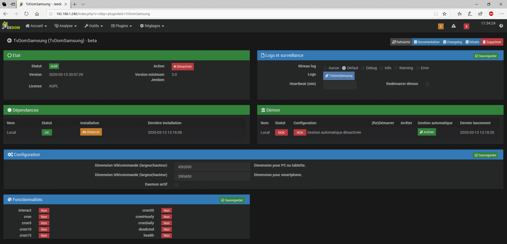

  

  

  The notable difference lies in the choice **Active Daemon** which is not checked.

After installing the plugin, you need to create an instance by clicking in the plugin menu on the multimedia submenu, then TvDomSamsung.


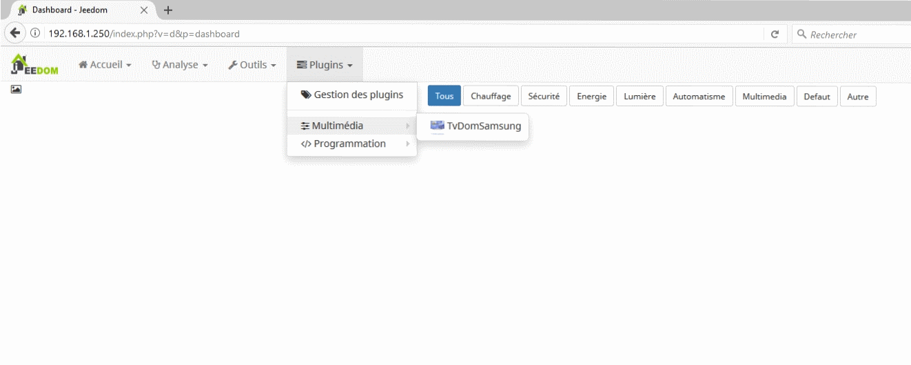


The input panel for a new device is then displayed:


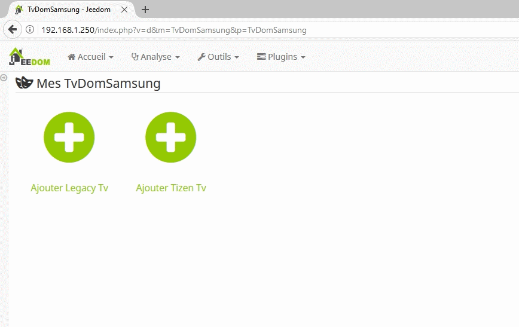

Click on add `Legacy` or` Tizen` depending on the Tv model, then enter the name of the equipment (for example, here, **Legacy_TV**, then confirm your choice:

For a **Legacy model**, the following page is displayed.

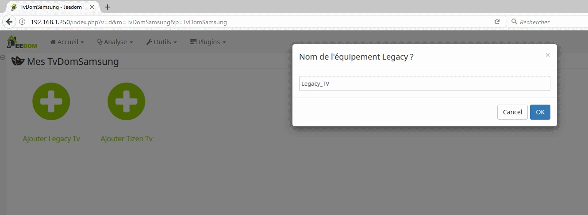


For a Tizen model, the following page is displayed. Here, the name of the equipment created will be **Tizen_TV**


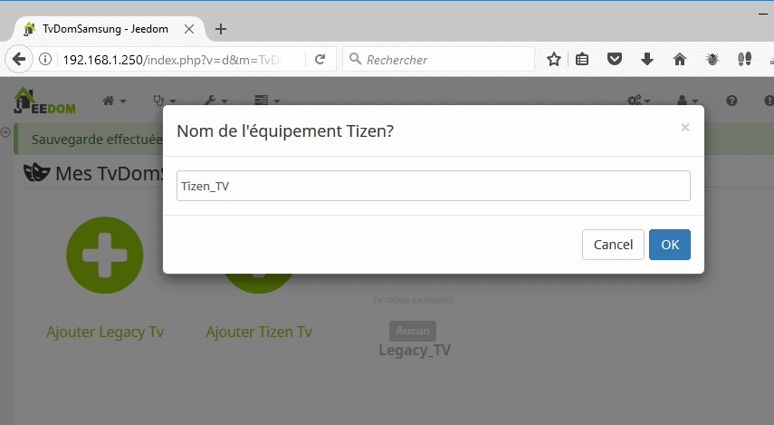

Then complete the configuration panel that appears with the requested information:

> Note that the model_tv information cannot be modified.

## Detailed configuration, Legacy model

The configuration panel of a Legacy model looks like this :


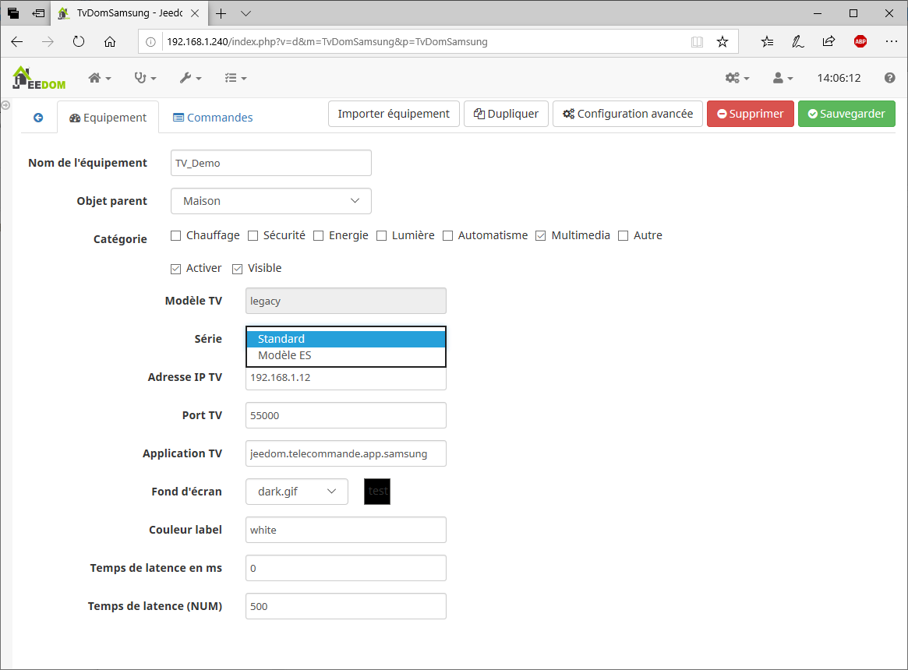

- ***TV model***

  It is a reminder of the TV model. Unchangeable.

- ***Series***

For the moment only two series are defined. The selection box allows you to choose:

```
*    Standard, general model,
*    ES, ES series model that requires a connection 	 authorization.
```

- ***TV IP address***   This is the IP address of the TV on your local network. You can find this information by accessing your TV's menu (network, setting).

- ***TV port***   It is the communication port with your Samsung TV. In principle, this is the port **55000**.

- ***TV application***   It is free application code. Here I have entered *jeedom.telecommande.samsung*.

- ***Wallpaper***   This choice allows you to set the wallpaper for the remote control.

- ***Label color***   Allows you to customize the color of the labels in conjunction with the wallpaper.

- **Latency**

  It is possible to send a key sequence to the TV from a scenario (see SendKey command).To respect a delay between the sending of each key, a latency time is necessary. Set the time in this parameter for the non-numeric keys on the remote control, for example: SOURCE, GUIDE, ENTER, etc.

- **Latency (NUM)**

  It is possible to send a key sequence to the TV from a scenario (see SendKey command).To respect a delay between the sending of each key, a latency time is necessary.In this parameter, set the time for the numeric keys of the remote control.

- ***Controls / Actions*** 

  Seven commands are defined, they allow you to control the SMART TV in scenarios.

  ​	`Activate ` : is only used to associate the widget on the dashboard

  ​	`Auth`: This command initiates the remote control authorization sequence by the TV. It is in 	principle reserved and activated from the plugin's remote control. Only applicable to 		  	LEGACY type TV models.

  ​	`Mute`: switch the Smart TV to silent mode (sound volume at 0). A second sending              	reposition the sound to the previous sound volume.

  ​	`Off`: This command turns off the television from a scenario.

  ​	`OnOff`: command to switch the television on or off as appropriate.
  
  ​	`SendKey`: This command is used in scenarios. see appendix_scenario, for more details on 	the use of this command.
  
  ​	`Zap`: This action causes a channel change. To do this, simply indicate the number of the    	channel to be selected as a parameter. This channel number must be between 1 and 99. 	The command has no effect if no channel matches the entered channel number. 
  
  For the 	plugin to work correctly, all fields must be filled in.

Then save the complete configuration of the equipment.

After viewing the Jeedom Dashboard, you should find a new widget that matches the newly configured Samsung TV.


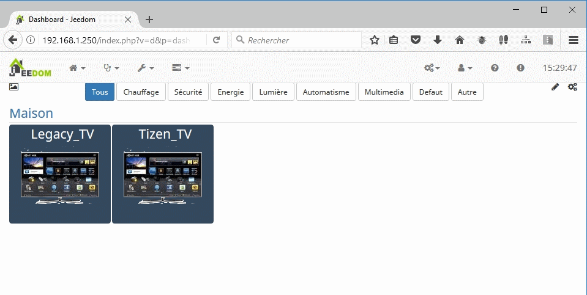

## Tizen model, detailed configuration

The configuration panel of a Tizen model looks like this :


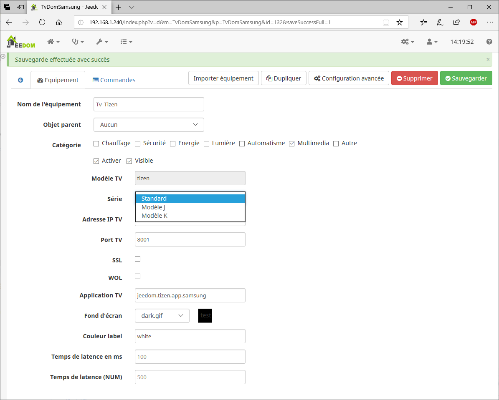

- ***TV model***

  It is a reminder of the TV model. Unchangeable.

- ***Series***

  For the moment only three series are defined. The selection box allows you to choose:

  ```
  *  Standard, general model,
  *  K, K series models requiring a specific communication protocol,
  *  J, J series models requiring a specific communication protocol, with   
     pairing. Requires to have made the daemon active and to have started it.    See the specific section on pairing (see remote control).
  ```

- ***IP TV Adress***

  This is the IP address of the TV on your local network. 

  You can find this information by accessing your TV's menu (network, setting).

- ***Port TV*** 

  It is the communication port with your Samsung TV. 

  In principle, this is the port **8001**.

- ***SSL***

  Indicator for encoding network frames with the SSL protocol.   

  > To be used in conjunction with port 8002.

- **WOL**

  Indicator used to switch on the television from the network. 

  (Please note, this option is not available on all Tizen models.)

  Check the **Direct**  option and enter a broadcast IP address, or check ** **Broadcast** ** if the sending is done over the entire network. In this case, enter the associated subnet mask. 

- ***Application TV***

  It is free application code. Here, I have entered *jeedom.tizen.app.samsung*.

  - 

  - ***Wallpaper***   This choice allows you to set the wallpaper for the remote control.

  - ***Label color***   Allows you to customize the color of the labels in conjunction with the wallpaper.

  - ***Controls / Actions***

    Seven commands are defined, they allow you to control the SMART TV in scenarios.

    ​	`Activate ` : is only used to associate the widget on the dashboard

    ​	`Auth`: This command initiates the remote control authorization sequence by the TV. It 	is in principle reserved and activated from the plugin's remote control. Only applicable 	to LEGACY type TV models.

    ​	`Mute`: switch the Smart TV to silent mode (sound volume at 0). A second sending              	reposition the sound to the previous sound volume.

    ​	`Off`: This command turns off the television from a scenario.

    ​	`OnOff`: command to switch the television on or off as appropriate.
  
    ​	`SendKey`: This command is used in scenarios. see appendix_scenario, for more details 	on the use of this command.
  
    ​	`Zap`: This action causes a channel change. To do this, simply indicate the number of 	the channel to be selected as a parameter. This channel number must be between 1 	and 99. The command has no effect if no channel matches the entered channel 		 	number. 
  
    > For the plugin to work correctly, all fields must be filled in.
  
  Then save the complete configuration of the equipment.
  
  After viewing the Jeedom Dashboard, you should find a new widget that matches the newly configured Samsung TV.
  
  


# Presentation of the remote control

The remote control is presented in the form of a window with several tabs:

- TNT
- Main, (Paved)
- Cmds (commandes)

These tabs are discussed in detail below.


## TNT tab


This tab presents all the DTT channels in a graphic mode. To activate a channel, click on the image of the channel.

To scroll through the pages, simply click on the right edge of the window to access the next page, or click on the left edge to display the previous page.

The screen looks like this:


Note the edges of the window in slight gradient, thus representing the scrolling zones: previous / next page.


## Main tab

It includes the most used keys.


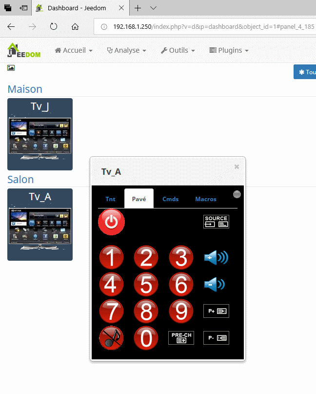


> ***Tips***
>
> Note in the upper right corner,  a button is displayed in gray (This button is present for Smart Tv Legacy, or J models).
>
> This button is used to launch an authorization sequence for connection to the television from a remote control. In principle this action is to be carried out only once. As soon as you press this button, a confirmation message is displayed on the television. Validate the response so that the plugin remote control can connect. **If this message does not appear**, Activate the TV menu choose network then **Allshare** then share. Then check that this connection is not marked **refused**, otherwise delete it and repeat the authorization step.


TV off button,

This button is used to switch off the television.


> TV models before 2014 (Legacy) cannot be switched on with the TvDomSamsung remote control. (Samsung limitation, because they do not have the wake up on lan function, see appendix on model compatibility).
>
> However, this is possible with the Samsung 2014 and following models running under Tizen. In this case, the button is a simple toggle that turns off or on the TV depending on the state of it.


The keys 0.1 ... to 9 allow you to change the channel. For channels with a number greater than 9 press several keys (normally 2 max).

The sound control buttons allow you to increase or decrease the volume.

​						

The mute button reduces the volume


The channel control buttons allows you to go to the next or previous channel.

​						

or go back to the previous channel


Finally, the **source** button allows you to select the source of the video signal: antenna, HDMI socket, and so on.


> For buttons other than the channel number commands, it is possible to use a cursors panel which allows you to navigate through the different choices. 
>
> This mode is presented later


## Commands tab

Il comprend la plupart des touches que l'on peut trouver sur la télécommande Samsung d'origine.

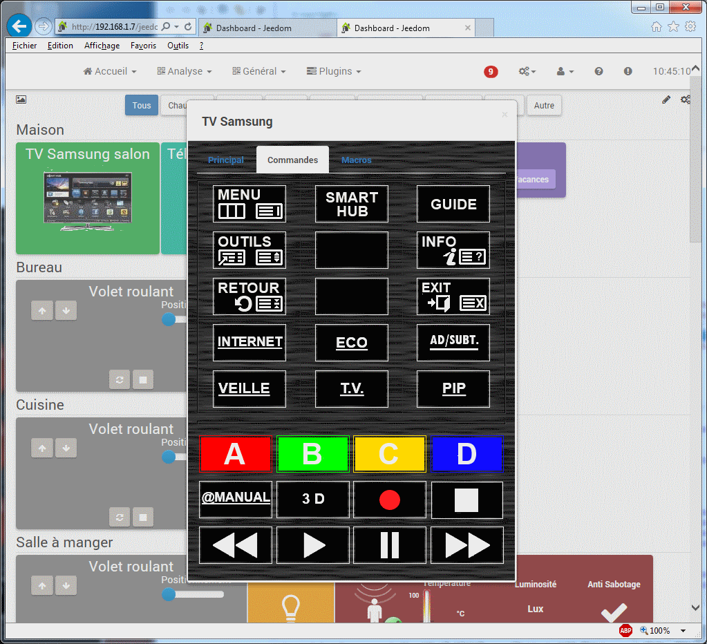


> **Tips**
>
> Depending on the key selected (eg MENU, GUIDE,...), you may need to use **movement cursors** (up, down, right, left or ENTER). 
>
> To do so, just click just below the tab separation line to bring up the cursors panel.


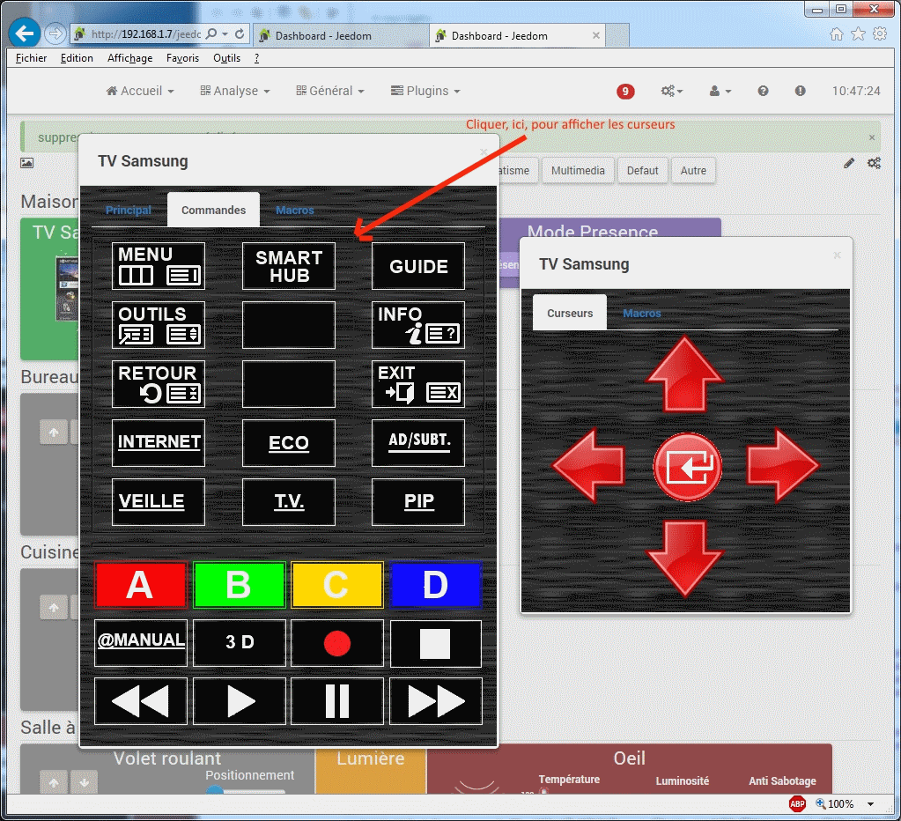


## Pairing of Smart TV models J

In order to be able to send commands to the television from the plugin, it is necessary to perform a pairing.

- Roughly speaking, pairing consists of:
- Request the display of an authorization code provided by the TV (Pin code),
- Transmit the pin code provided to the TV in order to authorize the Tv / Remote control dialogue,
- In return, if the pin code is validated, an encrypted token is returned by the Tv. This token will be used to encode Tv / Plugin exchanges.  

Thereafter, if this token is not provided or if it is incorrect, the connection cannot be made.

**Tips**

The pairing operation is to be carried out only once. The encryption token is memorized by the plugin and reused during the following connections.

Pairing may fail if the plugin is not authorized to communicate with the TV. For that, it is necessary to check at the level of the Tv menus that the plugin has not been rejected. In this case, delete, at the Tv menu, the refusal to connect the plugin, then restart the pairing.

The pairing is carried out using the remote control of the plugin, 

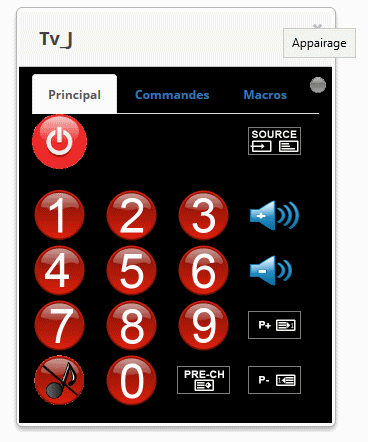

Just click on the gray button in the upper right corner of the remote control.

A confirmation screen is displayed

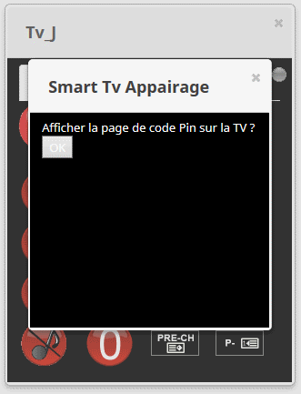

Appuyez sur le bouton OK pour afficher la page de code pin sur la TV.

Si la communication est établie avec la Tv, l'écran de saisie du code Pin est alors affiché :


Enter the pin code, then click on the button **pair Tv**


## Daemon associated with J models

1. **Prerequisites **

   The daemon runs in a Python 2.7 environment.

   During the installation of the plugin, the additional modules are installed from the network, they are necessary for the operation of the plugin.

   Websocket-client: 	web-socket client,
   Rijndael: 					cryptography module
   Ipaddress: 				IP address verification module
   Pycrypto: 				  cryptography module
   Aenum: 					python enumeration
   Requests: 				http modules

2. **Daemon directories**

   The daemon is stored within the plugin in the resources directory, it looks like this:

   

   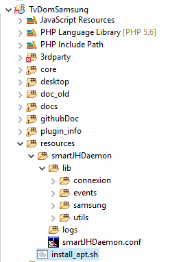

   

   The daemon logs are stored in the logs directory.
   The specific parameters of the daemon are stored in the smartJHDaemon.conf file.
   The procedure for installing the daemon is saved under: install_apt.sh.

   


# FAQ

## Compatibilité avec mon téléviseur Samsung ?

Pour les ***modèles antérieurs à 2014*** (nommés **legacy**). Les modèles fonctionnent correctement sur une communication  sur le port 55000.

**Il s'agit des modèles F, D et C.** 

For ***models prior to 2014*** (named **legacy**). The models work correctly on port 55000.

**These are models F, D and C, ES**

However, it is not possible to turn on the TV. There is no network wake-up function.

Pour les ***modèles postérieurs 2013** et suivants* (nommés **tizen**). Les modèles fonctionnent correctement sur une communication  sur le port 8001.
Les modèles validés à l'heure actuelle sont des modèles : K et M.

**Les modèles qui semblent poser problèmes** : 

Les modèles **H** restent **incompatibles** avec le plugin TvDomSamsung.

Vous trouverez, sur le forum, une page consacrée au plugin TvDomSamsung. Des utilitaires sont à disposition pour vérifier la compatibilité de votre TV avec le plugin.

For ***models after 2013  and later *** (named **tizen**). The models work correctly on a communication on port 8001.

The models currently validated are models: **K , N, R M/QLED**.

**Models that seem to be problematic**:

The **H models** remain **incompatible** with the TvDomSamsung plugin.

You will find, on the forum, a page dedicated to the TvDomSamsung plugin. Utilities are available to check the compatibility of your TV with the plugin.

This version allows connections to models of the J series.

**However, the plugin can only be used for one model J TV at the same time. The J model daemon can only be associated with one TV**.


## Problems encountered

Samsung released a firmware update for its Tizen model SmartTv in October 2018.

This had the consequence of making **the communication between the plugin and the TV ** incompatible. 

This problem was resolved by configuring an SSL connection on port 8002 for the K, N, R and M / QLED series.


# Annexes

## Utilisation du plugin dans un scénario

The following commands can be used in a scenario :


- ***mute***     : mute mode (toggle)

- ***off***          : switch off Tv 

- ***on_off***   : switch tv on/off (toggle).

- ***zap***        : change the channel. Set channel number with two digits. 

  ​		Example -> zap 24. Request set channel to 24.

- ***sendkey***  : send a request to tv. 

  A command can consist of one or more actions.

  If several actions are to be executed, they are separated by &#124; ( a pipe).

  - send a single command	:

    - *sendkey* KEY_MUTE   ( set Tv  to mode mute)

  - send a batch of actions

    - *sendkey* KEY_POWERON &#124; KEY_1   : switch on tv and set channel to  n° 1

    - To set tv channel with nuber > 9, command looks like this :

      *sendkey* KEY_1 &#124; KEY_8          : Set Tv channel  to 18


For example, to turn on the TV and go to channel 41, you just need to send  : 

  	sendkey KEY_POWERON &#124; KEY_4 &#124; KEY_1


## Commands available

Here is the list of commands that can be sent to Samsung TVs (Smart TV).


> 
>
> The successful execution of the command may be dependent on the television model.
>
> 

    KEY_0
    KEY_1
    KEY_2
    KEY_3
    KEY_4
    KEY_5
    KEY_6
    KEY_7
    KEY_8
    KEY_9
    KEY_11
    KEY_12
    KEY_3SPEED
    KEY_4_3
    KEY_16_9
    KEY_AD
    KEY_ADDDEL
    KEY_ALT_MHP
    KEY_ANGLE
    KEY_ANTENA
    KEY_ANYNET
    KEY_ANYVIEW
    KEY_APP_LIST
    KEY_ASPECT
    KEY_AUTO_ARC_ANTENNA_AIR
    KEY_AUTO_ARC_ANTENNA_CABLE
    KEY_AUTO_ARC_ANTENNA_SATELLITE
    KEY_AUTO_ARC_ANYNET_AUTO_START
    KEY_AUTO_ARC_ANYNET_MODE_OK
    KEY_AUTO_ARC_AUTOCOLOR_FAIL
    KEY_AUTO_ARC_AUTOCOLOR_SUCCESS
    KEY_AUTO_ARC_CAPTION_ENG
    KEY_AUTO_ARC_CAPTION_KOR
    KEY_AUTO_ARC_CAPTION_OFF
    KEY_AUTO_ARC_CAPTION_ON
    KEY_AUTO_ARC_C_FORCE_AGING
    KEY_AUTO_ARC_JACK_IDENT
    KEY_AUTO_ARC_LNA_OFF
    KEY_AUTO_ARC_LNA_ON
    KEY_AUTO_ARC_PIP_CH_CHANGE
    KEY_AUTO_ARC_PIP_DOUBLE
    KEY_AUTO_ARC_PIP_LARGE
    KEY_AUTO_ARC_PIP_LEFT_BOTTOM
    KEY_AUTO_ARC_PIP_LEFT_TOP
    KEY_AUTO_ARC_PIP_RIGHT_BOTTOM
    KEY_AUTO_ARC_PIP_RIGHT_TOP
    KEY_AUTO_ARC_PIP_SMALL
    KEY_AUTO_ARC_PIP_SOURCE_CHANGE
    KEY_AUTO_ARC_PIP_WIDE
    KEY_AUTO_ARC_RESET
    KEY_AUTO_ARC_USBJACK_INSPECT
    KEY_AUTO_FORMAT
    KEY_AUTO_PROGRAM
    KEY_AV1
    KEY_AV2
    KEY_AV3
    KEY_BACK_MHP
    KEY_BOOKMARK
    KEY_CALLER_ID
    KEY_CAPTION
    KEY_CATV_MODE
    KEY_CHDOWN
    KEY_CHUP
    KEY_CH_LIST
    KEY_CLEAR
    KEY_CLOCK_DISPLAY
    KEY_COMPONENT1
    KEY_COMPONENT2
    KEY_CONTENTS
    KEY_CONVERGENCE
    KEY_CONVERT_AUDIO_MAINSUB
    KEY_CUSTOM
    KEY_CYAN
    KEY_BLUE(KEY_CYAN)//ProxyforKEY_CYAN
    KEY_CYAN
    KEY_BLUE
    KEY_DEVICE_CONNECT
    KEY_DISC_MENU
    KEY_DMA
    KEY_DNET
    KEY_DNIe
    KEY_DNSe
    KEY_DOOR
    KEY_DOWN
    KEY_DSS_MODE
    KEY_DTV
    KEY_DTV_LINK
    KEY_DTV_SIGNAL
    KEY_DVD_MODE
    KEY_DVI
    KEY_DVR
    KEY_DVR_MENU
    KEY_DYNAMIC
    KEY_ENTER
    KEY_ENTERTAINMENT
    KEY_ESAVING
    KEY_EXIT
    KEY_EXT1
    KEY_EXT2
    KEY_EXT3
    KEY_EXT4
    KEY_EXT5
    KEY_EXT6
    KEY_EXT7
    KEY_EXT8
    KEY_EXT9
    KEY_EXT10
    KEY_EXT11
    KEY_EXT12
    KEY_EXT13
    KEY_EXT14
    KEY_EXT15
    KEY_EXT16
    KEY_EXT17
    KEY_EXT18
    KEY_EXT19
    KEY_EXT20
    KEY_EXT21
    KEY_EXT22
    KEY_EXT23
    KEY_EXT24
    KEY_EXT25
    KEY_EXT26
    KEY_EXT27
    KEY_EXT28
    KEY_EXT29
    KEY_EXT30
    KEY_EXT31
    KEY_EXT32
    KEY_EXT33
    KEY_EXT34
    KEY_EXT35
    KEY_EXT36
    KEY_EXT37
    KEY_EXT38
    KEY_EXT39
    KEY_EXT40
    KEY_EXT41
    KEY_FACTORY
    KEY_FAVCH
    KEY_FF
    KEY_FF_
    KEY_FM_RADIO
    KEY_GAME
    KEY_GREEN
    KEY_GUIDE
    KEY_HDMI
    KEY_HDMI1
    KEY_HDMI2
    KEY_HDMI3
    KEY_HDMI4
    KEY_HELP
    KEY_HOME
    KEY_ID_INPUT
    KEY_ID_SETUP
    KEY_INFO
    KEY_INSTANT_REPLAY
    KEY_LEFT
    KEY_LINK
    KEY_LIVE
    KEY_MAGIC_BRIGHT
    KEY_MAGIC_CHANNEL
    KEY_MDC
    KEY_MENU
    KEY_MIC
    KEY_MORE
    KEY_MOVIE1
    KEY_MS
    KEY_MTS
    KEY_MUTE
    KEY_NINE_SEPERATE
    KEY_OPEN
    KEY_PANNEL_CHDOWN
    KEY_PANNEL_CHUP
    KEY_PANNEL_ENTER
    KEY_PANNEL_MENU
    KEY_PANNEL_POWER
    KEY_PANNEL_SOURCE
    KEY_PANNEL_VOLDOW
    KEY_PANNEL_VOLUP
    KEY_PANORAMA
    KEY_PAUSE
    KEY_PCMODE
    KEY_PERPECT_FOCUS
    KEY_PICTURE_SIZE
    KEY_PIP_CHDOWN
    KEY_PIP_CHUP
    KEY_PIP_ONOFF
    KEY_PIP_SCAN
    KEY_PIP_SIZE
    KEY_PIP_SWAP
    KEY_PLAY
    KEY_PLUS100
    KEY_PMODE
    KEY_POWER
    KEY_POWEROFF
    KEY_POWERON
    KEY_PRECH
    KEY_PRINT
    KEY_PROGRAM
    KEY_QUICK_REPLAY
    KEY_REC
    KEY_RED
    KEY_REPEAT
    KEY_RESERVED1
    KEY_RETURN
    KEY_REWIND
    KEY_REWIND_
    KEY_RIGHT
    KEY_RSS//Internet
    KEY_RSS
    KEY_INTERNET(KEY_RSS)//ProxyforKEY_RSS
    KEY_INTERNET
    KEY_RSURF
    KEY_SCALE
    KEY_SEFFECT
    KEY_SETUP_CLOCK_TIMER
    KEY_SLEEP
    KEY_SOUND_MODE
    KEY_SOURCE
    KEY_SRS
    KEY_STANDARD
    KEY_STB_MODE
    KEY_STILL_PICTURE
    KEY_STOP
    KEY_SUB_TITLE
    KEY_SVIDEO1
    KEY_SVIDEO2
    KEY_SVIDEO3
    KEY_TOOLS
    KEY_TOPMENU
    KEY_TTX_MIX
    KEY_TTX_SUBFACE
    KEY_TURBO
    KEY_TV
    KEY_TV_MODE
    KEY_UP
    KEY_VCHIP
    KEY_VCR_MODE
    KEY_VOLDOWN
    KEY_VOLUP
    KEY_WHEEL_LEFT
    KEY_WHEEL_RIGHT
    KEY_W_LINK//MediaP
    KEY_W_LINK
    KEY_YELLOW
    KEY_ZOOM1
    KEY_ZOOM2
    KEY_ZOOM_IN
    KEY_ZOOM_MOVE
    KEY_ZOOM_OUT


# Compatibility 


Here is the list of Smart Tvs supported by the plugin:


<table>
<thead>
<tr>
<th align="center">Models</th>
<th align="center">Support</th>
<th align="center">Mode</th>
<th align="center">Port</th>
<th align="center">SSL</th>
<th align="center">WOL</th>
<th align="center">Samsung Software</th>
<th align="center">Year</th>
<th>Incompatibles</th>
</tr>
</thead>
<tbody>
<tr>
<td align="center">Series C</td>
<td align="center">Yes</td>
<td align="center">socket</td>
<td align="center">55000</td>
<td align="center"></td>
<td align="center">No</td>
<td align="center">Legacy</td>
<td align="center">2014</td>
<td>C6200</td>
</tr>
<tr>
<td align="center">Series D</td>
<td align="center">Yes</td>
<td align="center">socket</td>
<td align="center">55000</td>
<td align="center"></td>
<td align="center">No</td>
<td align="center">Legacy</td>
<td align="center"> < 2014</td>
<td>D450</td>
</tr>
<tr>
<td align="center">Series E(S/H)</td>
<td align="center">Yes</td>
<td align="center">socket</td>
<td align="center">55000</td>
<td align="center"></td>
<td align="center">No</td>
<td align="center">Legacy</td>
<td align="center"> < 2014</td>
<td>E450</td>
</tr>
<tr>
<td align="center">Series F</td>
<td align="center">Yes</td>
<td align="center">socket</td>
<td align="center">55000</td>
<td align="center"></td>
<td align="center">No</td>
<td align="center">Legacy</td>
<td align="center"> < 2014</td>
<td>F4000 </td>
</tr>
<tr>
<td align="center">Series H</td>
<td align="center">No</td>
<td align="center"></td>
<td align="center"></td>
<td align="center">Pin code</td>
<td align="center">No</td>
<td align="center"></td>
<td align="center">2014</td>
<td align="center"> </td>
</tr>
<tr>
<td align="center">Series J</td>
<td align="center">Yes</td>
<td align="center"></td>
<td align="center"></td>
<td align="center">Pin code</td>
<td align="center">No</td>
<td align="center">Tizen</td>
<td align="center">2015</td>
<td >J4xxx, J50xx, J51xx, J52xx, J53xx, <br> UNxxJ6200, J6201,<br> J6203, J620D </td>
</tr>
<tr>
<td align="center">Series K</td>
<td align="center">Yes</td>
<td align="center">webSocket</td>
<td align="center">8001</td>
<td align="center"></td>
<td align="center">Yes</td>
<td align="center">Tizen</td>
<td align="center">2016</td>
<td align="center"> </td>
</tr>
<tr>
<td align="center">Series K *</td>
<td align="center">Yes</td>
<td align="center">webSocket</td>
<td align="center">8002</td>
<td align="center">SSL</td>
<td align="center">Yes</td>
<td align="center">Tizen</td>
<td align="center">2016</td>
<td align="center">  </td>
</tr>
<tr>
<td align="center">Series M/Qled</td>
<td align="center">Yes</td>
<td align="center">webSocket</td>
<td align="center">8001</td>
<td align="center"></td>
<td align="center">Yes</td>
<td align="center">Tizen</td>
<td align="center">2017</td>
<td>Mxxx5, MUxxx5</td>
</tr>
<tr><td align="center">Series M/Qled *</td>
<td align="center">Yes</td>
<td align="center">webSocket</td>
<td align="center">8002</td>
<td align="center">SSL</td>
<td align="center">Yes</td>
<td align="center">Tizen</td>
<td align="center">2017</td>
<td>Mxxx5, MUxxx5</td>
</tr>
<tr>
<td align="center">Series N *</td>
<td align="center">Yes</td>
<td align="center">webSocket</td>
<td align="center">8002</td>
<td align="center">SSL</td>
<td align="center">Yes</td>
<td align="center">Tizen</td>
<td align="center">2018</td>
<td>Nxxx3, NUxxx3</td>
</tr><tr>
<td align="center">Series R *</td>
<td align="center">Yes</td>
<td align="center">webSocket</td>
<td align="center">8002</td>
<td align="center">SSL</td>
<td align="center">Yes</td>
<td align="center">Tizen</td>
<td align="center">2019</td>
<td>Rxxx3, RUxxx3</td>
</tr>

</tbody>
</table>


* Since October 2018, Tizen models with connection on port 8002 in SSL.

* Some models are not supported, see list above

* WOL support (wake on lan, TV switch on from the network)

  

# Detailed changelog 

><https://berco63.github.io/TvDomSamsung/en_US/changelog>