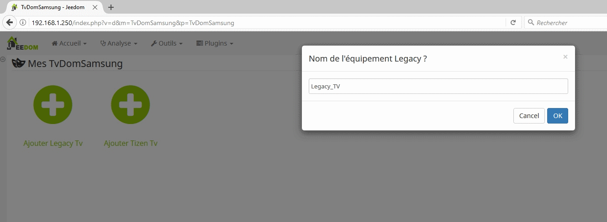
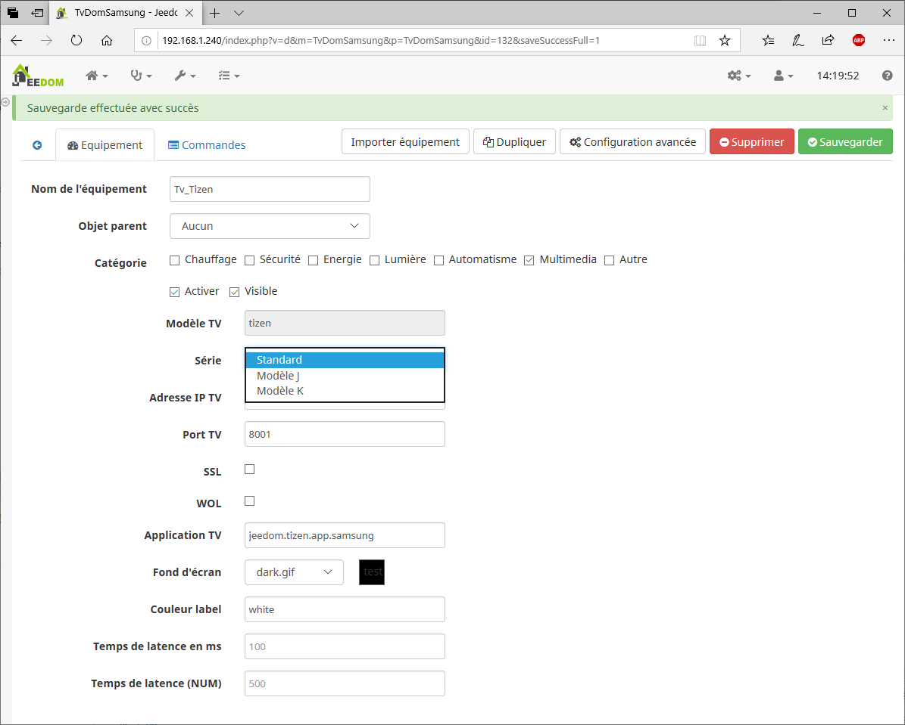
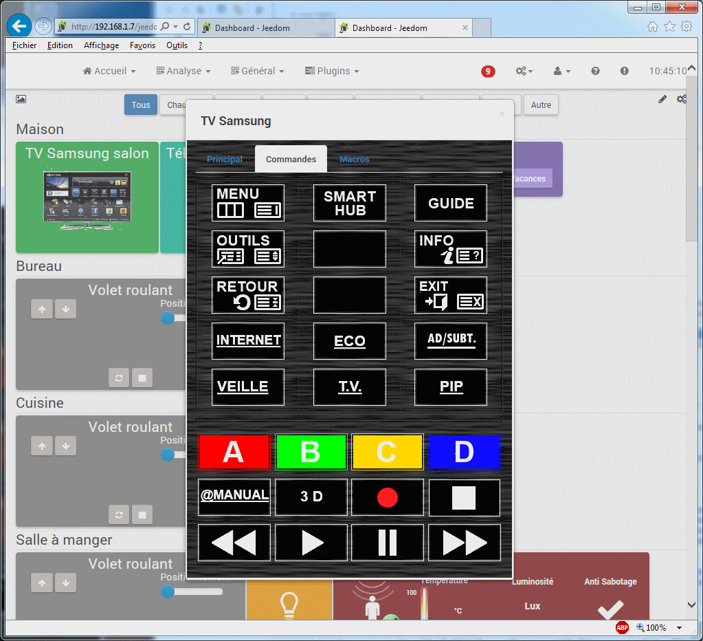
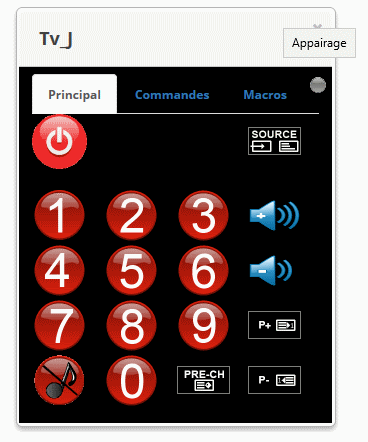
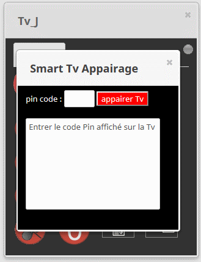
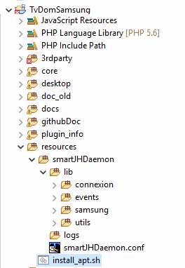

# Le plugin 

TvDomSamsung : plugin permettant de commander à distance les Tv Samsung.

# Description

Le plugin TvDomSamsung sert à piloter une TV Samsung (*smart, connectée*) acceptant un pilotage depuis des commandes émises sur le réseau local.

> Le plugin est associé à un widget spécifique (SamsungTv) qui est inclus dans le plugin. Ce widget est installé sur le dashboard et sert de lanceur au module télécommande.


## Le plugin

Le plugin dans sa version 1.0.D nécessite d'être configuré. Pour cela activer le menu **Plugins -> Gestion des plugins**, puis cliquer sur l'icone du plugin TvDomSamsung.

L'écran de configuration du plugin se présente suivant deux variantes :

​	**<u>Variante n° 1:</u> Samsung Smart Tv Legacy ou Tizen ( autres que modèles J)**

​    Dans cette variante, le plugin fonctionne sans démon et ne nécessite donc pas d'installer des dépendances ni par ailleurs de lancer un démon.

​	L'écran de configuration se présente ainsi:


Le panneau de configuration comprend notamment :

- les paramètres propres à la configuration de la télécommande sont les suivants,

  - Indication de la dimension souhaitée d'affichage de la télécommande pour un PC ou une tablette. Indiquer, ici, les dimensions (largeur&#124;hauteur) . Fournir deux nombres séparés par le symbole '&#124;'.

  - Indication de la dimension souhaitée d'affichage de la télécommande pour un téléphone mobile. Indiquer, ici, les dimensions (largeur&#124;hauteur) . Fournir deux nombres séparés par le symbole '&#124;'.

- le paramètre d'activation pour les modèles J. 

  Par défaut le plugin présente lors de son installation un panneau de configuration pour les modèles Legacy ou Tizen. 

  **Si vous souhaitez configurer une Smart Tv modèle J** , il faut cocher la case **Daemon actif**, afin d'avoir accès aux paramètres détaillés  de la configuration d'un modèle J. L'écran est présenté dans la variante n° 2 (ci-dessous).

  

**<u>Variante n° 2:</u> Samsung Smart Tv modèles J**

​    Dans cette variante, le plugin fonctionne en utilisant un démon qui sert d'interface entre le plugin et la Smart Tv. Il est alors nécessaire d'installer des dépendances puis  de lancer le démon.

​	L'écran de configuration se présente ainsi:


Le panneau de configuration comprend notamment :

- la gestion des dépendances,
- la gestion du daemon propre aux modèles Samsung J,
- les paramètres propres à la configuration de la télécommande,
  - Indication de la dimension souhaitée d'affichage de la télécommande pour un PC ou une tablette. Indiquer, ici, les dimensions (largeur&#124;hauteur) . Fournir deux nombres séparés par le symbole '&#124;'.
  - Indication de la dimension souhaitée d'affichage de la télécommande pour un téléphone mobile. Indiquer, ici, les dimensions (largeur&#124;hauteur) . Fournir deux nombres séparés par le symbole ''&#124;'.

- les paramètres essentiels du daemon.

Les paramètres du daemon sont les suivants:

- Temps de pause : délai nécessaire entre l'envoi d'une séquence de commandes au téléviseur. (Utilisé par la commande sendKey dans un scénario par exemple).

- Daemon actif, à cocher uniquement pour les modèles Samsung J. Le daemon ne sera lancé que si ce choix est activé. Il est donc inutile pour les autres modèles de TV.
- Port daemon : port de communication du daemon. Sélectionner un port disponible sur la machine où sera installé le daemon.
- Http time out : time out pour les liaisons http. Peut être adapté en fonction de la latence de la Tv.
- Connexion time out. (idem).
- Niveau de log. En fonctionnement normal, afin de minimiser le volume des logs, positionner le niveau sur INFO.

Une fois la saisie réalisée, sauvegardez les paramètres du panneau de configuration. Puis, dans l'ordre :

- Lancer les dépendances.
- Démarrer le démon.


**Après avoir installé le plugin, il vous faut créer une occurrence en cliquant dans le menu plugin sur le sous-menu multimédia, puis TvDomSamsung.**


Le panneau de saisie d'un nouvel équipement s'affiche alors :


Cliquer sur ajouter `Legacy` ou `Tizen` suivant le modèle du Tv, puis renseigner le nom de l'équipement (par exemple, ici , **Legacy_TV**, puis validez votre choix.

Pour un modèle Legacy, la page suivante est affichée.




Pour un modèle Tizen, la page suivante est affichée. Ici, le nom de l'équipement crée sera **Tizen_TV**


Complétez ensuite le panneau de configuration qui s'affiche avec les informations demandées : 

> A noter que l'information modèle_tv ne peut être modifiée.


## Configuration détaillée, modèle Legacy

Le panneau de configuration d'un modèle Legacy se présente ainsi :


- ***Modèle TV***

C'est le rappel du modèle de téléviseur. Non modifiable.

- ***Série***

Pour l'instant seules deux séries sont définies. La boîte de sélection permet de choisir:

```
*    Standard, modèle général,
*    ES, modèle de la série ES nécessitant obligatoirement l'autorisation de connexion.
```

- ***Adresse IP TV***

  C'est l'adresse IP du téléviseur sur votre réseau local . Vous pouvez trouver cette information en accédant au menu de votre téléviseur ( réseau, paramètre).

- ***Port TV*** 

  C'est le port de communication avec votre téléviseur Samsung. En principe, il s'agit du port **55000**.

- ***Application TV***

  C'est un code applicatif libre. Ici, j'ai renseigné  *jeedom.telecommande.samsung*.

- ***Fond écran***

  Ce choix permet de définir le fond d'écran de la télécommande.

- ***Couleur label***

  Permet de personnaliser al couleur des labels en conjonction avec le fond d'écran.

- ***Temps de latence***

  Il est possible d'envoyer une séquence de touches vers la Tv à partir d'un scénario (voir commande SendKey). 
  Pour respecter un délai entre l'envoi de chaque touche, un temps de latence est nécessaire. Positionner dans ce paramètre le temps pour les touches non numériques de la télécommande, par exemple : SOURCE, GUIDE, ENTER, etc.

- ***Temps de latence (NUM)***

  Il est possible d'envoyer une séquence de touches vers la Tv à partir d'un scénario (voir commande SendKey). 
  Pour respecter un délai entre l'envoi de chaque touche, un temps de latence est nécessaire. 

  Positionner dans ce paramètre le temps pour les touches  numériques de la télécommande.

- ***Commandes/Actions***

    Sept commandes sont définies, elles permettent de piloter la SMART TV dans des scénarios.

  `Activer` : sert uniquement à associer le widget sur le dashboard

  `Auth` : Cette commande permet d'initier la séquence d'autorisation de la télécommande par le téléviseur. Elle est en principe réservée et activée depuis la télécommande du plugin. Ne concerne que les modèles de téléviseur du type LEGACY.

  `Mute` : permet de passer la Smart TV en mode silencieux (volume du son à 0). Un deuxième envoi repositionne le son au volume sonore précédent.

  `Off` : Cette commande permet d'éteindre le téléviseur depuis un scénario.

  `OnOff` : commande d'allumage ou d'extinction du téléviseur suivant le cas.

  `SendKey` : Cette commande est utilisée dans les scénarios. voir annexe_scenario, pour plus de précision sur l'utilisation de cette commande.

  `Zap` : Cette action provoque un changement de chaîne. Pour cela, il suffit d'indiquer en paramètre le n° de la chaîne à sélectionner. Ce n° de chaîne doit être compris entre  1 et 99. La commande n'a aucun effet si aucun canal ne correspond au n° de chaîne entré.

> Pour que le plugin fonctionne correctement, toutes les zones doivent être renseignées .

Puis, enregistrez la configuration complète de l'équipement.

Après affichage du Dashboard Jeedom, vous devriez trouver un nouveau widget correspondant au téléviseur Samsung nouvellement configuré.


## Configuration détaillée, modèle Tizen

Le panneau de configuration d'un modèle Tizen se présente ainsi :




- ***Modèle TV***

  C'est le rappel du modèle de téléviseur. Non modifiable.

- ***Série***

  Pour l'instant seules deux séries sont définies. La boîte de sélection permet de choisir:

      *    Standard, modèle général,
      *    K, modèles de la *série K* nécessitant un protocole de communication spécifique.
      *    J, modèles de la *série J* nécessitant un protocole de communication spécifique, avec appairage. Nécessite d'avoir rendu le daemon actif et de l'avoir démarré.
           Voir la rubrique spécifique à l'appairage (voir télécommande).

- ***Adresse IP TV***

  C'est l'adresse IP du téléviseur sur votre réseau local . Vous pouvez trouver cette information en accédant au menu de votre téléviseur ( réseau, paramètre).

- ***Port TV*** 

  C'est le port de communication avec votre téléviseur Samsung. En principe, il s'agit du port **8001**.

- ***SSL***

  Indicateur d'encodage des trames réseau avec le protocole SSL.

  > A utiliser conjointement avec le port 8002.

- **WOL**

  Indicateur servant à allumer la télévision depuis la réseau. Attention, cette option n'est pas disponible sur tous les modèles Tizen. 

  Cocher l'option **Direct**  et renseigner une adresse IP de broadcast , ou cocher **Broadcast** si l'envoi est fait sur tout le réseau. Dans ce cas, saisir le masque de sous réseau associé.

- ***Application TV***

  C'est un code applicatif libre. Ici, j'ai renseigné  *jeedom.tizen.app.samsung*.

- ***Fond écran***

  Ce choix permet de définir le fond d'écran de la télécommande.

- ***Couleur label***

  Permet de personnaliser al couleur des labels en conjonction avec le fond d'écran.

- ***Temps de latence***

  Il est possible d'envoyer une séquence de touches vers la Tv à partir d'un scénario (voir commande SendKey). 
  Pour respecter un délai entre l'envoi de chaque touche, un temps de latence est nécessaire. Positionner dans ce paramètre le temps pour les touches non numériques de la télécommande, par exemple : SOURCE, GUIDE, ENTER, etc.

- ***Temps de latence (NUM)***

  Il est possible d'envoyer une séquence de touches vers la Tv à partir d'un scénario (voir commande SendKey). 
  Pour respecter un délai entre l'envoi de chaque touche, un temps de latence est nécessaire. 

  Positionner dans ce paramètre le temps pour les touches  numériques de la télécommande.

- ***Commandes/Actions***

  Sept commandes sont définies, elles permettent de piloter la SMART TV dans des scénarios.

  `Activer` : sert uniquement à associer le widget sur le dashboard

  `Auth` : Cette commande permet d'initier la séquence d'autorisation de la télécommande par le téléviseur. Elle est en principe réservée et activée depuis la télécommande du plugin. Ne concerne que les modèles de téléviseur du type LEGACY.

  `Mute` : permet de passer la Smart TV en mode silencieux (volume du son à 0). Un deuxième envoi repositionne le son au volume sonore précédent.

  `Off` : Cette commande permet d'éteindre le téléviseur depuis un scénario.

  `OnOff` : commande d'allumage ou d'extinction du téléviseur suivant le cas.

  `SendKey` : Cette commande est utilisée dans les scénarios. voir annexe_scenario, pour plus de précision sur l'utilisation de cette commande.

  `Zap` : Cette action provoque un changement de chaîne. Pour cela, il suffit d'indiquer en paramètre le n° de la chaîne à sélectionner. Ce n° de chaîne doit être compris entre 1 et 99. La commande n'a aucun effet si aucun canal ne correspond au n° de chaîne entré.
  
  > Pour que le plugin fonctionne correctement, toutes les zones doivent être renseignées .

Puis, enregistrez la configuration complète de l'équipement.

Après affichage du Dashboard Jeedom, vous devriez trouver un nouveau widget correspondant au téléviseur Samsung nouvellement configuré.


# Présentation de la télécommande

La télécommande se présente sous forme d'une fenêtre présentant  plusieurs onglets :

- Tnt

- Principal, (Pavé)
- Commandes

Ces onglets sont présentés de façon détaillée, ci-dessous.


## L'onglet TNT


Cet onglet présente l'ensemble des chaînes  de la TNT suivant un mode graphique. Pour activer une chaîne, cliquer sur l'image de la chaîne.

Pour faire défiler les pages, il suffit de cliquer sur le bord droit de la fenêtre pou accéder à la page suivante, ou bien de cliquer sur le bord gauche pour

afficher la page précédente.

L'écran se présente ainsi:


Noter les bords de la fenêtre en léger dégradé figurant ainsi les zones de défilement : page précédente/suivante.


## L'onglet Principal

Il comprend l'ensemble des touches les plus utilisées.


> ***Tips***
>
> Notez dans le coin supérieur droit un bouton affiché en gris.(Ce bouton est présent pour les Smart Tv Legacy, ou modèles J).
>
> Ce bouton sert à lancer une séquence d'autorisation de connexion au téléviseur depuis une télécommande. En principe cette action n'est à réaliser qu'une seule fois. Dès que vous appuyez sur ce bouton, un message de confirmation est affiché sur le téléviseur. Validez la réponse pour que la télécommande du plugin puisse se connecter.*Si ce message n'apparaît pas*, Activer le menu du téléviseur choisir réseau puis  Allshare puis partage. vérifier alors que cette connexion n'est pas marquée **refusée**, sinon la supprimer et recommencer l'étape d'autorisation.


Bouton d'arrêt du téléviseur

Cette touche sert à éteindre le téléviseur.


> Les modèles de téléviseur avant 2014 (Legacy) ne peuvent être allumés par la télécommande TvDomSamsung. (Limitation Samsung, car il ne dispose pas de la fonction wake up on lan).
>
> Par contre, cela est possible avec les modèles Samsung 2014 et suivants s'exécutant sous Tizen. 
>
> Dans ce cas, le bouton est une simple bascule qui éteint ou allume le téléviseur suivant l'état de celui-ci. 


Les touches 0,1 ... à 9 permettent de changer de chaîne. Pour les chaînes  de n° plus grand que 9 appuyer sur plusieurs touches (en principe 2 maxi).

Les touches de contrôle du son permettent d'augmenter ou diminuer le volume sonore.

​						

le bouton mute permet de réduire le volume sonore


Les touches de contrôle des chaînes permettent de passer à la chaîne suivante ou à la chaîne précédente.

​						

ou bien retourner à la chaîne précédente


Enfin , le bouton *source* permet de sélectionner la provenance du signal vidéo : antenne, prise HDMI, etc.


> Pour les boutons autres que les commandes de numéro de chaînes, il est possible d'utiliser un panneau de curseurs qui permet de naviguer dans les différents choix. Ce mode est présenté ultérieurement.


## L'onglet commandes

Il comprend la plupart des touches que l'on peut trouver sur la télécommande Samsung d'origine.




> **Tips**
>
> Il est possible suivant la touche sélectionnée (par ex MENU, GUIDE, etc .) d'avoir besoin d'utiliser des **curseurs de déplacement** (haut,bas, droite, gauche ou ENTREE). 
>
> Pour cela, il suffit de cliquer juste en dessous du trait de séparation des onglets pour faire apparaître le panneau de visualisation des curseurs.


## Appairage des Smart TV modèles J

Afin de pouvoir envoyer des commandes à la télévision depuis le plugin, il est nécessaire de réaliser un appairage.

Grosso modo l'appairage consiste à :

- demander l'affichage d'un code d'autorisation fourni par la TV (code Pin),

- Transmettre à la TV le code pin fourni afin d'autoriser le dialogue Tv/Télécommande,

- En retour, si le code pin est validé, un jeton crypté est retourné par la Tv. Ce jeton servira à encoder les échanges Tv/Plugin. 

  Par la suite, si ce jeton n'est pas fourni ou s'il est incorrect., la connexion ne pourra se faire.

  

  **Tips**

  L'opération d'appairage n'est à réaliser qu'une seule fois. Le jeton de cryptage est mémorisé par le plugin et réutilisé lors des connexions suivantes.

  L'appairage peut échouer si le plugin n'est pas autorisé à dialoguer avec la TV. Pour cela, il faut vérifier au niveau des menus du Tv que le plugin n'a  pas été rejeté. Dans ce cas, supprimer, au niveau du menu de la Tv, le refus de connexion du plugin, puis relancer l'appairage.


L'appairage est réalisé à l'aide de la télécommande du plugin, 



Il suffit de cliquer sur le bouton gris dans le coin supérieur droit de la télécommande. 

Un écran de confirmation est affiché 


Appuyez sur le bouton OK pour afficher la page de code pin sur la TV.

Si la communication est établie avec la Tv, l'écran de saisie du code Pin est alors affiché :




Saisir le code pin, puis cliquer sur le bouton **appairer Tv**


## Daemon associé aux modèles J

1. **Prè-requis**

   Le daemon exécute dans un environnement Python 2.7.

   Lors de l'installation du plugin, les modules complémentaires sont installés depuis le réseau, ils sont nécessaires au fonctionnement du plugin.

   ​	websocket-client     : client web-socket,
   ​	rijndael                    : module de cryptographie
   ​	ipaddress   	     : module de vérification d'adresse IP
   ​	pycrypto                  : module de cryptographie
   ​	aenum                   : enumération python
   ​	requests                   : modules http

2. **Structure répertoire daemon**

   Le daemon est stocké au sein du plugin dans le répertoire resources, il se présente ainsi :

   

   

   Les logs du daemon sont stockés dans le répertoire logs.

   Les paramètres spécifiques du daemon sont stockés dans le fichier smartJHDaemon.conf.

   La procédure d'installation du daemon est enregistrée sous : install_apt.sh.

   


# FAQ

## Compatibilité avec mon téléviseur Samsung ?

Pour les ***modèles antérieurs à 2014*** (nommés **legacy**). Les modèles fonctionnent correctement sur une communication  sur le port 55000.

**Il s'agit des modèles F, D et C.** 

Cependant, il n'est pas possible d'allumer le téléviseur. Il n'y a pas de fonction de réveil réseau.

Pour les ***modèles postérieurs 2013** et suivants* (nommés **tizen**). Les modèles fonctionnent correctement sur une communication  sur le port 8001.
Les modèles validés à l'heure actuelle sont des modèles : K et M.

**Les modèles qui semblent poser problèmes** : 

Les modèles **H** restent **incompatibles** avec le plugin TvDomSamsung.

Vous trouverez, sur le forum, une page consacrée au plugin TvDomSamsung. Des utilitaires sont à disposition pour vérifier la compatibilité de votre TV avec le plugin.


Cette version beta devrait permettre des connexions aux modèles J. 

**Cependant, le plugin ne pourra servir en même temps qu'une seule TV de modèle J. En effet, le daemon modèle J ne peut être associé qu'à une seule TV.** 


## Problèmes rencontrés

Samsung a délivré une mise à jour du firmware de ses SmartTv modèle Tizen en Octobre 2018. 

Ceci a eu pour conséquence de rendre **incompatible la communication entre le plugin et la TV**.
Ce problème est en cours d'étude.  Il n'est pas recommandé d'acquérir le plugin si vous avez installé le dernier firmware sur votre modèle Tizen.

**Ce problème est résolu depuis la version V1.0.C de décembre 2018.**


# Annexes

## Utilisation du plugin dans un scénario

Les commandes suivantes sont utilisables dans un scénario :

- **off**: éteindre le téléviseur

- ***mute***     : mode silencieux (en bascule)

- ***on_off***   : allumer:éteindre le téléviseur (en bascule).

- ***zap***        : changer de chaîne. fournir le canal à sélectionner sur deux digits. 

  ​		Exemple -> zap 24. Demande affichage canal 24.

- ***sendkey***  : envoi d'une commande au TV. 

  Une commande peut être constituée d'une ou de plusieurs actions. 

  Si plusieurs actions sont à exécuter, elles sont séparées par &#124; ( un pipe).

  - envoi d'une commande simple	:

    - *sendkey* KEY_MUTE   ( bascule le Tv en mode muet)

  - envoi d'un lot d'actions

    - *sendkey* KEY_POWERON &#124; KEY_1   : allume la tv et affiche la chaîne n° 1

    - Pour afficher une chaîne avec un n° > 9 la commande se présente ainsi:

      *sendkey* KEY_1 &#124; KEY_8          : demande l'affichage de la chaîne 18                 


  Par exemple, pour allumer le TV et passer au canal 41, il suffit d'envoyer : 

  	sendkey* KEY_POWERON &#124; KEY_4 &#124; KEY_1


## Commandes disponibles

Voici la liste des commandes qui peuvent être envoyées aux téléviseurs Samsung (Smart TV).


> La bonne exécution de la commande peut être dépendante du modèle de téléviseur.
>
>

    KEY_0
    KEY_1
    KEY_2
    KEY_3
    KEY_4
    KEY_5
    KEY_6
    KEY_7
    KEY_8
    KEY_9
    KEY_11
    KEY_12
    KEY_3SPEED
    KEY_4_3
    KEY_16_9
    KEY_AD
    KEY_ADDDEL
    KEY_ALT_MHP
    KEY_ANGLE
    KEY_ANTENA
    KEY_ANYNET
    KEY_ANYVIEW
    KEY_APP_LIST
    KEY_ASPECT
    KEY_AUTO_ARC_ANTENNA_AIR
    KEY_AUTO_ARC_ANTENNA_CABLE
    KEY_AUTO_ARC_ANTENNA_SATELLITE
    KEY_AUTO_ARC_ANYNET_AUTO_START
    KEY_AUTO_ARC_ANYNET_MODE_OK
    KEY_AUTO_ARC_AUTOCOLOR_FAIL
    KEY_AUTO_ARC_AUTOCOLOR_SUCCESS
    KEY_AUTO_ARC_CAPTION_ENG
    KEY_AUTO_ARC_CAPTION_KOR
    KEY_AUTO_ARC_CAPTION_OFF
    KEY_AUTO_ARC_CAPTION_ON
    KEY_AUTO_ARC_C_FORCE_AGING
    KEY_AUTO_ARC_JACK_IDENT
    KEY_AUTO_ARC_LNA_OFF
    KEY_AUTO_ARC_LNA_ON
    KEY_AUTO_ARC_PIP_CH_CHANGE
    KEY_AUTO_ARC_PIP_DOUBLE
    KEY_AUTO_ARC_PIP_LARGE
    KEY_AUTO_ARC_PIP_LEFT_BOTTOM
    KEY_AUTO_ARC_PIP_LEFT_TOP
    KEY_AUTO_ARC_PIP_RIGHT_BOTTOM
    KEY_AUTO_ARC_PIP_RIGHT_TOP
    KEY_AUTO_ARC_PIP_SMALL
    KEY_AUTO_ARC_PIP_SOURCE_CHANGE
    KEY_AUTO_ARC_PIP_WIDE
    KEY_AUTO_ARC_RESET
    KEY_AUTO_ARC_USBJACK_INSPECT
    KEY_AUTO_FORMAT
    KEY_AUTO_PROGRAM
    KEY_AV1
    KEY_AV2
    KEY_AV3
    KEY_BACK_MHP
    KEY_BOOKMARK
    KEY_CALLER_ID
    KEY_CAPTION
    KEY_CATV_MODE
    KEY_CHDOWN
    KEY_CHUP
    KEY_CH_LIST
    KEY_CLEAR
    KEY_CLOCK_DISPLAY
    KEY_COMPONENT1
    KEY_COMPONENT2
    KEY_CONTENTS
    KEY_CONVERGENCE
    KEY_CONVERT_AUDIO_MAINSUB
    KEY_CUSTOM
    KEY_CYAN
    KEY_BLUE(KEY_CYAN)//ProxyforKEY_CYAN
    KEY_CYAN
    KEY_BLUE
    KEY_DEVICE_CONNECT
    KEY_DISC_MENU
    KEY_DMA
    KEY_DNET
    KEY_DNIe
    KEY_DNSe
    KEY_DOOR
    KEY_DOWN
    KEY_DSS_MODE
    KEY_DTV
    KEY_DTV_LINK
    KEY_DTV_SIGNAL
    KEY_DVD_MODE
    KEY_DVI
    KEY_DVR
    KEY_DVR_MENU
    KEY_DYNAMIC
    KEY_ENTER
    KEY_ENTERTAINMENT
    KEY_ESAVING
    KEY_EXIT
    KEY_EXT1
    KEY_EXT2
    KEY_EXT3
    KEY_EXT4
    KEY_EXT5
    KEY_EXT6
    KEY_EXT7
    KEY_EXT8
    KEY_EXT9
    KEY_EXT10
    KEY_EXT11
    KEY_EXT12
    KEY_EXT13
    KEY_EXT14
    KEY_EXT15
    KEY_EXT16
    KEY_EXT17
    KEY_EXT18
    KEY_EXT19
    KEY_EXT20
    KEY_EXT21
    KEY_EXT22
    KEY_EXT23
    KEY_EXT24
    KEY_EXT25
    KEY_EXT26
    KEY_EXT27
    KEY_EXT28
    KEY_EXT29
    KEY_EXT30
    KEY_EXT31
    KEY_EXT32
    KEY_EXT33
    KEY_EXT34
    KEY_EXT35
    KEY_EXT36
    KEY_EXT37
    KEY_EXT38
    KEY_EXT39
    KEY_EXT40
    KEY_EXT41
    KEY_FACTORY
    KEY_FAVCH
    KEY_FF
    KEY_FF_
    KEY_FM_RADIO
    KEY_GAME
    KEY_GREEN
    KEY_GUIDE
    KEY_HDMI
    KEY_HDMI1
    KEY_HDMI2
    KEY_HDMI3
    KEY_HDMI4
    KEY_HELP
    KEY_HOME
    KEY_ID_INPUT
    KEY_ID_SETUP
    KEY_INFO
    KEY_INSTANT_REPLAY
    KEY_LEFT
    KEY_LINK
    KEY_LIVE
    KEY_MAGIC_BRIGHT
    KEY_MAGIC_CHANNEL
    KEY_MDC
    KEY_MENU
    KEY_MIC
    KEY_MORE
    KEY_MOVIE1
    KEY_MS
    KEY_MTS
    KEY_MUTE
    KEY_NINE_SEPERATE
    KEY_OPEN
    KEY_PANNEL_CHDOWN
    KEY_PANNEL_CHUP
    KEY_PANNEL_ENTER
    KEY_PANNEL_MENU
    KEY_PANNEL_POWER
    KEY_PANNEL_SOURCE
    KEY_PANNEL_VOLDOW
    KEY_PANNEL_VOLUP
    KEY_PANORAMA
    KEY_PAUSE
    KEY_PCMODE
    KEY_PERPECT_FOCUS
    KEY_PICTURE_SIZE
    KEY_PIP_CHDOWN
    KEY_PIP_CHUP
    KEY_PIP_ONOFF
    KEY_PIP_SCAN
    KEY_PIP_SIZE
    KEY_PIP_SWAP
    KEY_PLAY
    KEY_PLUS100
    KEY_PMODE
    KEY_POWER
    KEY_POWEROFF
    KEY_POWERON
    KEY_PRECH
    KEY_PRINT
    KEY_PROGRAM
    KEY_QUICK_REPLAY
    KEY_REC
    KEY_RED
    KEY_REPEAT
    KEY_RESERVED1
    KEY_RETURN
    KEY_REWIND
    KEY_REWIND_
    KEY_RIGHT
    KEY_RSS//Internet
    KEY_RSS
    KEY_INTERNET(KEY_RSS)//ProxyforKEY_RSS
    KEY_INTERNET
    KEY_RSURF
    KEY_SCALE
    KEY_SEFFECT
    KEY_SETUP_CLOCK_TIMER
    KEY_SLEEP
    KEY_SOUND_MODE
    KEY_SOURCE
    KEY_SRS
    KEY_STANDARD
    KEY_STB_MODE
    KEY_STILL_PICTURE
    KEY_STOP
    KEY_SUB_TITLE
    KEY_SVIDEO1
    KEY_SVIDEO2
    KEY_SVIDEO3
    KEY_TOOLS
    KEY_TOPMENU
    KEY_TTX_MIX
    KEY_TTX_SUBFACE
    KEY_TURBO
    KEY_TV
    KEY_TV_MODE
    KEY_UP
    KEY_VCHIP
    KEY_VCR_MODE
    KEY_VOLDOWN
    KEY_VOLUP
    KEY_WHEEL_LEFT
    KEY_WHEEL_RIGHT
    KEY_W_LINK//MediaP
    KEY_W_LINK
    KEY_YELLOW
    KEY_ZOOM1
    KEY_ZOOM2
    KEY_ZOOM_IN
    KEY_ZOOM_MOVE
    KEY_ZOOM_OUT


# Compatibilité 

Voici la liste des Smart Tv supportées par le plugin :


<table>
<thead>
<tr>
<th align="center">Modèles</th>
<th align="center">Support</th>
<th align="center">Mode</th>
<th align="center">Port</th>
<th align="center">SSL</th>
<th align="center">WOL</th>
<th align="center">Samsung Software</th>
<th align="center">Year</th>
<th>Incompatibles</th>
</tr>
</thead>
<tbody>
<tr>
<td align="center">Série C</td>
<td align="center">Oui</td>
<td align="center">socket</td>
<td align="center">55000</td>
<td align="center"></td>
<td align="center">Non</td>
<td align="center">Legacy</td>
<td align="center">2014</td>
<td>C6200</td>
</tr>
<tr>
<td align="center">Série D</td>
<td align="center">Oui</td>
<td align="center">socket</td>
<td align="center">55000</td>
<td align="center"></td>
<td align="center">Non</td>
<td align="center">Legacy</td>
<td align="center"> < 2014</td>
<td>D450</td>
</tr>
<tr>
<td align="center">Series E(S/H)</td>
<td align="center">Oui</td>
<td align="center">socket</td>
<td align="center">55000</td>
<td align="center"></td>
<td align="center">Non</td>
<td align="center">Legacy</td>
<td align="center"> < 2014</td>
<td>E450</td>
</tr>
<tr>
<td align="center">Série F</td>
<td align="center">Oui</td>
<td align="center">socket</td>
<td align="center">55000</td>
<td align="center"></td>
<td align="center">Non</td>
<td align="center">Legacy</td>
<td align="center"> < 2014</td>
<td>F4000 </td>
</tr>
<tr>
<td align="center">Série H</td>
<td align="center">Non</td>
<td align="center"></td>
<td align="center"></td>
<td align="center">code Pin</td>
<td align="center">Non</td>
<td align="center"></td>
<td align="center">2014</td>
<td align="center"> </td>
</tr>
<tr>
<td align="center">Série J</td>
<td align="center">Oui</td>
<td align="center"></td>
<td align="center"></td>
<td align="center">code Pin</td>
<td align="center">Non</td>
<td align="center">Tizen</td>
<td align="center">2015</td>
<td >J4xxx, J50xx, J51xx, J52xx, J53xx, <br> UNxxJ6200, J6201,<br> J6203, J620D </td>
</tr>
<tr>
<td align="center">Série K</td>
<td align="center">Oui</td>
<td align="center">webSocket</td>
<td align="center">8001</td>
<td align="center"></td>
<td align="center">Oui</td>
<td align="center">Tizen</td>
<td align="center">2016</td>
<td align="center"> </td>
</tr>
<tr>
<td align="center">Série K *</td>
<td align="center">Oui</td>
<td align="center">webSocket</td>
<td align="center">8002</td>
<td align="center">SSL</td>
<td align="center">Oui</td>
<td align="center">Tizen</td>
<td align="center">2016</td>
<td align="center">  </td>
</tr>
<tr>
<td align="center">Série M/Qled</td>
<td align="center">Oui</td>
<td align="center">webSocket</td>
<td align="center">8001</td>
<td align="center"></td>
<td align="center">Oui</td>
<td align="center">Tizen</td>
<td align="center">2017</td>
<td>Mxxx5, MUxxx5</td>
</tr>
<tr><td align="center">Série M/Qled *</td>
<td align="center">Oui</td>
<td align="center">webSocket</td>
<td align="center">8002</td>
<td align="center">SSL</td>
<td align="center">Oui</td>
<td align="center">Tizen</td>
<td align="center">2017</td>
<td>Mxxx5, MUxxx5</td>
</tr>
<tr>
<td align="center">Série N *</td>
<td align="center">Oui</td>
<td align="center">webSocket</td>
<td align="center">8002</td>
<td align="center">SSL</td>
<td align="center">Oui</td>
<td align="center">Tizen</td>
<td align="center">2018</td>
    <td>Nxxx3, NUxxx3</td>
</tr><tr>
<td align="center">Série R *</td>
<td align="center">Oui</td>
<td align="center">webSocket</td>
<td align="center">8002</td>
<td align="center">SSL</td>
<td align="center">Oui</td>
<td align="center">Tizen</td>
<td align="center">2019</td>
    <td>Rxxx3, RUxxx3</td>
</tr>


</tbody>
</table>


* Depuis Octobre 2018, modèles Tizen avec connexion sur port 8002 en SSL.
* Certains modèles ne sont pas supportés, voir liste ci-dessus
* Support WOL ( wake on lan, allumage TV depuis le réseau)


# Changelog détaillé


> >>>>>> <https://berco63.github.io/TvDomSamsung/fr_FR/changelog>

